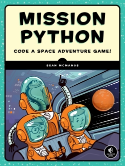
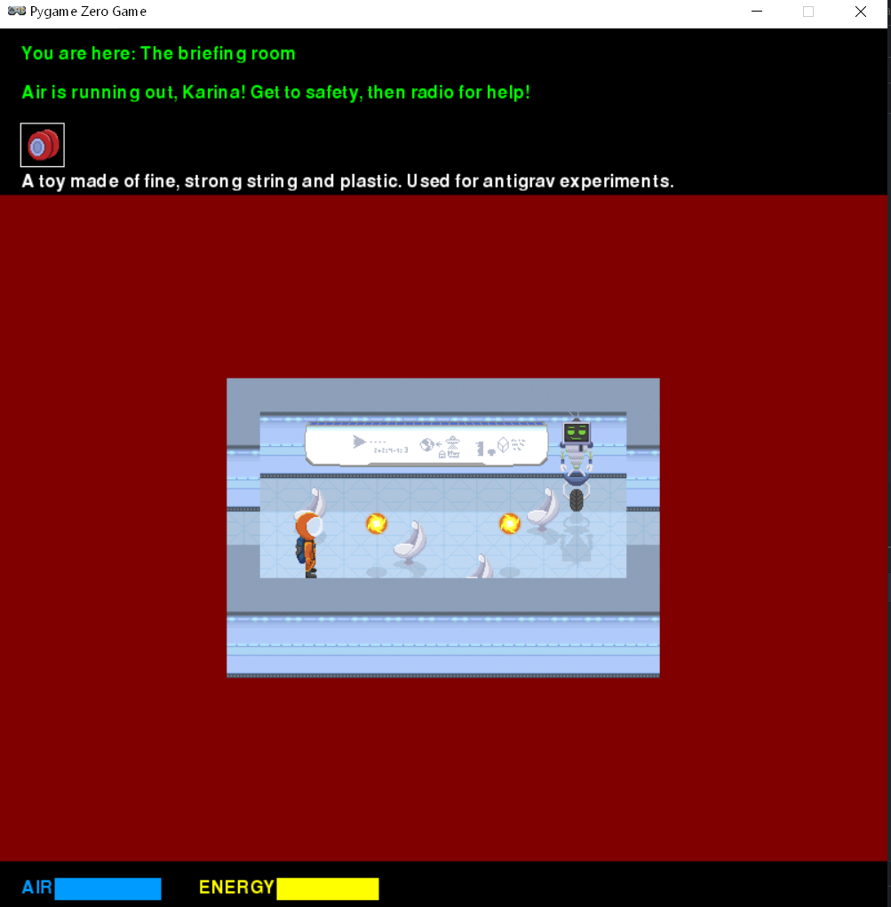

# Space game
This game was created using a book "Mission Python" of Sean McManus.



## Source

Code and sound effects by Sean McManus (www.sean.co.uk)
Images by Rafael Pimenta.

You can use these assets to make your own Python games, provided that you credit the source and that you do not sell or otherwise make money from your games.

To find out more about the book, visit:
http://www.sean.co.uk/books/mission-python/

For information on Sean's other books, including Cool Scratch Projects in Easy Steps and Raspberry Pi For Dummies, visit:
http://www.sean.co.uk/books/index.shtm

## Game


## Installing

```
pip install -r requirements.txt
```

## Run app

```
pgzrun escape.py
```

## Built With

* Python 3.8
* Pygame 1.9.6
